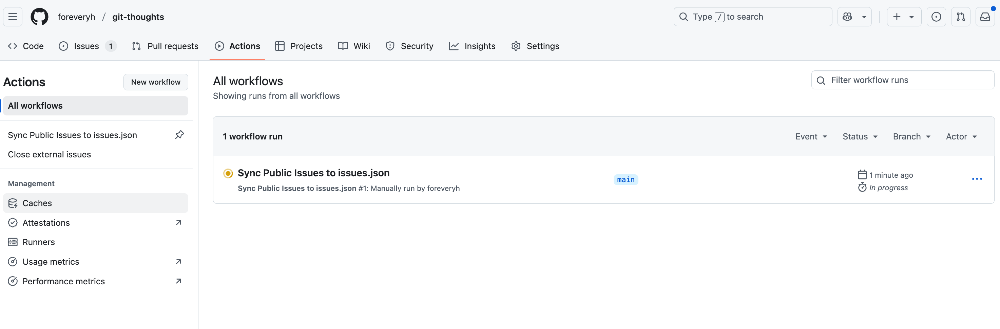

This repository serves as a system for using GitHub Issues as a micro-notes platform, similar to a microblog or services like Flomo. It periodically processes these issues and exports their content into a JSON file, making them accessible for external applications or services.

# Git-Thoughts: Issues to JSON Sync

This repository automatically processes GitHub Issues labeled "Public" and generates a `public/issues.json` file. This allows you to use GitHub Issues as a lightweight CMS for micro-notes or blog posts, with the content made available in a structured JSON format.

---

## How It Works

The system relies on a GitHub Actions workflow that periodically runs a Node.js script.

1.  **GitHub Actions Workflow (`.github/workflows/sync-issues.yml`):**
    *   **Triggers:** The workflow is configured to run on a schedule (e.g., daily) and can also be triggered manually.
    *   **Process:**
        *   Checks out the repository.
        *   Sets up a Node.js environment.
        *   Installs necessary dependencies (specifically `node-fetch`).
        *   Executes the `fetch_issues.js` script, passing a GitHub token for API authentication.
        *   Commits and pushes the updated `public/issues.json` file back to the repository if any changes are detected.

2.  **Node.js Script (`fetch_issues.js`):**
    *   This script uses the GitHub API to fetch all open issues within this repository that are tagged with the "Public" label.
    *   It extracts relevant information from each issue, such as its ID, number, title, body, creation/update timestamps, and any other labels (excluding "Public" itself, which are treated as content tags).
    *   The collected data is then written to the `public/issues.json` file.

3.  **GitHub Token:**
    *   A GitHub Personal Access Token (PAT) with `repo` scope is required for the script to authenticate with the GitHub API and fetch issues.
    *   This token is stored as a repository secret named `MY_GITHUB_TOKEN` and is accessed by the workflow.

---

## Key Components & Configuration

*   **Workflow File:** `.github/workflows/sync-issues.yml` (defines the automation).
*   **Sync Script:** `fetch_issues.js` (handles API interaction and data processing).
*   **GitHub Secret:** `MY_GITHUB_TOKEN` (stores the PAT securely for the workflow).
*   **Environment Variable for Script:** The workflow passes `GITHUB_REPO` (e.g., `foreveryh/git-thoughts`) to the `fetch_issues.js` script.

---

## Output

The primary output is the `public/issues.json` file located in the `public/` directory. This file contains an array of your public issues, structured for easy consumption.

Example structure of an issue object within the JSON:
```json
{
  "id": 12345678,
  "number": 42,
  "title": "My Awesome Note",
  "body": "This is the content of my note.",
  "url": "https://github.com/foreveryh/git-thoughts/issues/42",
  "created_at": "2023-01-01T10:00:00Z",
  "updated_at": "2023-01-01T11:00:00Z",
  "tags": ["thoughts", "tech"]
}
```

---

## Consuming the Data (e.g., for a Blog)

To use the generated `issues.json` in an external application, such as a blog:

1.  Fetch the JSON file directly from its raw GitHub URL:
    `https://raw.githubusercontent.com/foreveryh/git-thoughts/main/public/issues.json`
2.  Parse the JSON data and display it as required.
    *   For static site generators or frameworks like Next.js, you can use data-fetching methods (e.g., `getStaticProps`) to retrieve this data at build time or via Incremental Static Regeneration (ISR).

---

## Running the Workflow Manually

If you need to update the `issues.json` file immediately without waiting for the scheduled run:

1.  Navigate to the **Actions** tab of this repository on GitHub.
2.  In the left sidebar, click on the **"Sync Public Issues to issues.json"** workflow.
3.  Click the **"Run workflow"** button, then confirm by clicking the green **"Run workflow"** button in the dropdown.

The workflow will execute, and if there are any new or updated public issues, the `public/issues.json` file will be updated.

---

## Example Workflow Run

The following image shows an example of the "Sync Public Issues to issues.json" workflow running:

